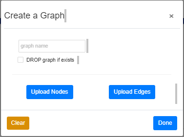
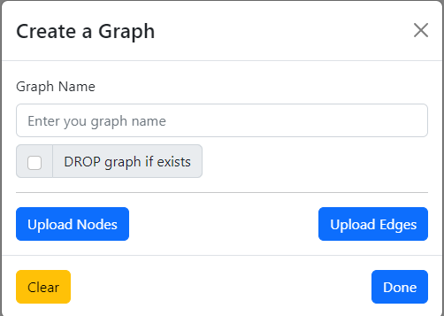

# Bitnine Task

This is a task for Bitnine about further developing the Apache AGE Viewer.

## Task description

The task was to create a new styled modal instead of the old one that looks non-framework use modal. The modal is used to display the create graph modal.

## Development environment

- React 18.2.0
- React-bootstrap 2.7.4

## Implementation

I used the Modal component from React-bootstrap to create a new modal that is responsive, accessible, and customizable.

Here is the code for the new modal component:

### Here is a comparison of the old modal and the new modal:

**_Old modal Image_**

**_New modal Image_**

